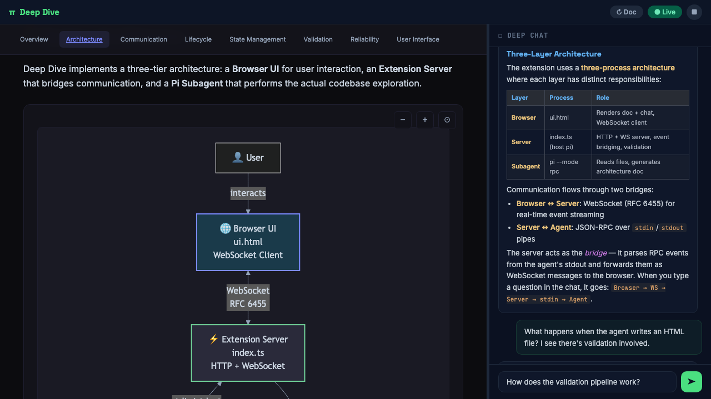

# Deep Dive

You join a new project. There's no architecture doc. The README says "see the code." You spend half a day clicking through files trying to understand how anything connects to anything.

Deep Dive fixes that. It spawns an AI agent that reads your entire codebase, builds a mental model of the architecture, and writes it up as a rich HTML document — with mermaid diagrams, module breakdowns, data flow explanations, and real code walkthroughs. You watch it happen live in your browser.

But the document is just the starting point. Once the agent has explored the codebase, it **stays around as a knowledgeable colleague**. The chat sidebar lets you ask follow-up questions, dig into specifics, or ask it to explain something differently. The agent already has context from reading the actual source — so the conversation is grounded in what's really in the code, not hallucinated guesses.



## Install

```bash
pi install https://github.com/rezkam/boring
```

> Or try without installing: `pi -e https://github.com/rezkam/boring`

## Quick Start

```
/deep-dive
```

That's it. A browser tab opens with a split-panel UI. The agent starts reading your codebase and generating the document on the left. The URL and session token are printed in your terminal — paste the token in the browser to connect.

## What You Get

### Architecture Document (left panel)
- **Mermaid diagrams** — system architecture, data flows, sequence diagrams, state machines — all generated from the actual code, not templates
- **Syntax-highlighted code blocks** — real code from your codebase with explanations of what it does and why
- **Metrics cards** — lines of code, file counts, language, key stats at a glance
- **Sticky navigation** — jump between sections; wraps responsively on narrow viewports
- **Dark theme** — designed for developers who live in dark mode

### Live Chat (right panel)
- **Ask anything** about the codebase — the agent has already read the files
- **Select text** from the document → click "📎 Ask about this" to use it as context
- **Rich responses** — tables, code blocks, headings, bold/italic, bullet lists, all rendered inline
- **Streaming** — watch the response arrive word by word
- **Persistent** — messages survive page refresh

### Reliability
- **Auto-restart** — if the agent crashes, it restarts automatically (up to 3 times with exponential backoff)
- **Health monitoring** — server pings the agent every 15s; if it stops responding, the UI shows "Unresponsive" immediately
- **Post-write sanitization** — every HTML write is automatically scanned and fixed: CDN URLs normalized to pinned versions, missing dependencies injected
- **Mermaid validation** — every diagram is validated with `mermaid-cli`; broken diagrams get sent back to the agent to fix automatically (up to 3 cycles)
- **Session persistence** — stop and come back later with `/deep-dive-resume`

## Usage

```
/deep-dive [prompt] [--path ./subdir] [--depth level] [--model name]
```

Everything that isn't a flag is your prompt — no quotes needed.

| Flag | Description |
|------|-------------|
| `prompt` | Topic or question to focus on (no quotes needed) |
| `--path` | Subdirectory to scope the exploration (repeatable) |
| `--depth` | `shallow` · `medium` (default) · `deep` |
| `--model` | LLM model to use (default: `claude-sonnet-4-5`) |
| `--help` | Show usage examples |

### Full Exploration (no prompt)

Explores the entire codebase: project structure, entry points, all major modules, dependency graph.

```
/deep-dive                              # explore everything
/deep-dive --depth deep                 # more diagrams, more code examples
/deep-dive --depth shallow              # quick overview, faster
/deep-dive --path ./src                 # full exploration scoped to ./src
```

### Focused Exploration (with prompt)

Give it a question and it explores **only** what's relevant — skips unrelated modules entirely. Faster than a full exploration.

```
/deep-dive how does authentication work
/deep-dive explain the WebSocket reconnection logic
/deep-dive error handling patterns --path ./src --depth deep
```

### Scoping with `--path`

Narrow exploration to specific subdirectories. The agent reads project config for context but focuses the document on the scoped area.

```
/deep-dive --path ./src/api             # explore only the API module
/deep-dive --path ./src --path ./lib    # focus on src and lib
/deep-dive auth flow --path ./src/auth  # focused prompt + scoped directory
/deep-dive ./src/workers                # auto-detected (starts with ./)
```

### Depth Levels

| Depth | Full Exploration | Focused Exploration |
|-------|-----------------|---------------------|
| `shallow` | 3-5 diagrams, ~800 lines, fast | 2-3 diagrams, ~500 lines, very fast |
| `medium` | 7-12 diagrams, ~1500 lines | 4-7 diagrams, ~1000 lines |
| `deep` | 12-18+ diagrams, 2000+ lines | 8-12+ diagrams, 1500+ lines |

## Other Commands

| Command | What it does |
|---------|-------------|
| `/deep-dive-resume` | Resume a previous session in this directory |
| `/deep-dive-stop` | Stop the agent and shut down the server |

`/deep-dive-resume` shows a picker if you have multiple sessions:

```
Resume which session?
  📄 "how does auth work?" (medium) — 2h ago
  📄 full exploration (deep) — 1d ago
  ⏳ "error handling" [./src/api] (shallow) — 3d ago
```

## How It Works

```
Browser (ui.html)
    ↕ WebSocket
Extension Server (index.ts, runs inside pi)
    ↕ JSON-RPC over stdin/stdout
Subagent (pi --mode rpc, child process)
```

1. You run `/deep-dive` → the extension starts an HTTP + WebSocket server and spawns a pi subagent
2. The subagent reads files, follows imports, builds understanding — streams events back via JSON-RPC
3. The server bridges those events to the browser over WebSocket — you see the document build in real time
4. When the agent writes HTML, the server sanitizes CDN URLs, validates mermaid diagrams, and auto-fixes errors
5. You ask questions in the chat — the agent already has full context from its exploration

Each session is stored locally in your project:

```
your-project/
  .pi/deep-dive/
    a3f29b12/          # session 1
      document.html    # the generated architecture doc
      meta.json        # session metadata (prompt, scope, depth, timestamp)
      agent.log        # debug log with timestamps
    c7e4d001/          # session 2
      ...
```

You can run multiple deep dives concurrently from different terminals — each gets its own port and agent process.

## Authentication

The server generates a random session token on startup, printed in your terminal. Paste it in the browser to connect. This prevents other localhost processes from accessing the document or controlling the agent.
